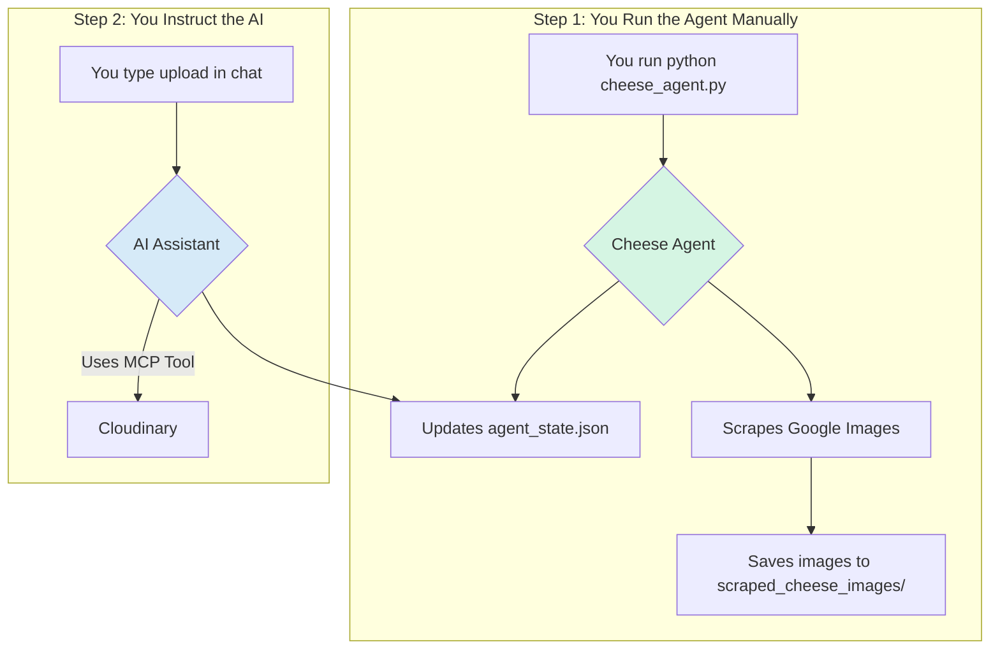

# 🧀 Cheesy MCP: An Interactive Cheese Image Scraper

This project demonstrates an interactive workflow where a Python agent finds and prepares cheese images, and an AI assistant uses Cloudinary's MCP tools to upload them.

It showcases a modern development pattern where a local script handles data gathering, and an AI assistant, equipped with powerful tools, performs the final actions based on your commands.

## ✨ **Features:**

- **Automated Scraping**: A Python script uses Selenium and the built-in Selenium Manager to find and download high-quality, commercially-licensed cheese photos from Google Images.
- **MCP Tool Integration**: Install the MCP server you need from the list [here](https://github.com/cloudinary/mcp-servers) in Cursor which starts a workflow to store your Cloudinary credentials in the MCP Cursor settings.
- **Interactive Upload Workflow**: The agent finds images and adds them to a queue. You can then instruct the AI assistant to upload the files from this queue.
- **Resilient State Management**: The agent keeps track of its run history, scraped images, and the pending upload queue in a simple JSON state file.
- **Secure Credential Management**: Stores Cloudinary credentials in your Cursor settings for the MCP integration.

## 🚀 **How It Works**

The process is a two-step collaboration between the Python agent and the AI assistant.

1.  **Run the Agent to Find Images**: You execute the `cheese_agent.py` script.
    - It scrapes Google Images for new cheese pictures.
    - It saves them locally to the `scraped_cheese_images/` directory.
    - It adds the new files to the `pending_uploads` queue in `cheese_agent_output/agent_state.json`.

2.  **Instruct the AI to Upload**: Once the agent has found images, you simply tell your AI assistant to perform the upload.
    - **Example prompt:** `"upload"` or `"upload the pending cheese images"`
    - The assistant will then:
        - Read the `pending_uploads` queue from the state file.
        - Use the Cloudinary MCP `upload-asset` tool to upload each image.
        - Update the state file to remove the image from the queue.
        - Delete the local image file.

## 🔧 **Getting Started**

### **Prerequisites:**
- **Python 3.9+**
- **A Cloudinary Account**
- An AI development environment that supports MCP tools (like Cursor).

### **Installation & Configuration:**

1.  **Clone the Repository**:
    ```bash
    git clone <your-repo-url>
    cd cheesy-mcp
    ```

2.  **Install Python Dependencies**:
    ```bash
    pip install -r requirements.txt
    ```

3.  **Set Up Your Environment**:
    Install the MCP server you need from the list [here](https://github.com/cloudinary/mcp-servers) in Cursor which starts a workflow to store your Cloudinary credentials in the MCP Cursor settings for asset management. There are handy 'add to Cursor' buttons you can use.

## ▶️ **Running the System**

The entire workflow is manual and interactive.

1.  **Step 1: Run the Agent to Find Images**
    Execute the agent script from your terminal.
    ```bash
    python3 cheese_agent.py
    ```
    The agent will print its progress and let you know how many images it found and added to the queue.

2.  **Step 2: Instruct the AI Assistant to Upload**
    In your AI assistant's chat, simply ask it to perform the upload.
    > **`upload`**

    The assistant will handle the rest! Check the metadata to make sure the image is tagged properly. You can monitor its progress in the chat and check your Cloudinary media library to see the newly uploaded cheeses.

## 🧀 **Cheese Categories:**

The agent automatically tags images with standard cheese categories:
- `bloomy`
- `blue`
- `fresh`
- `hard`
- `semi-soft`
- `washed-rind`

The images are tagged and uploaded. You can always overwrite the tags that are written in `agent_state.json` during your upload process, if something looks off. This is the curation process of the workflow.

## **Architecture:**



---

**🎉 You now have a streamlined, interactive cheese scraping and management system!** 